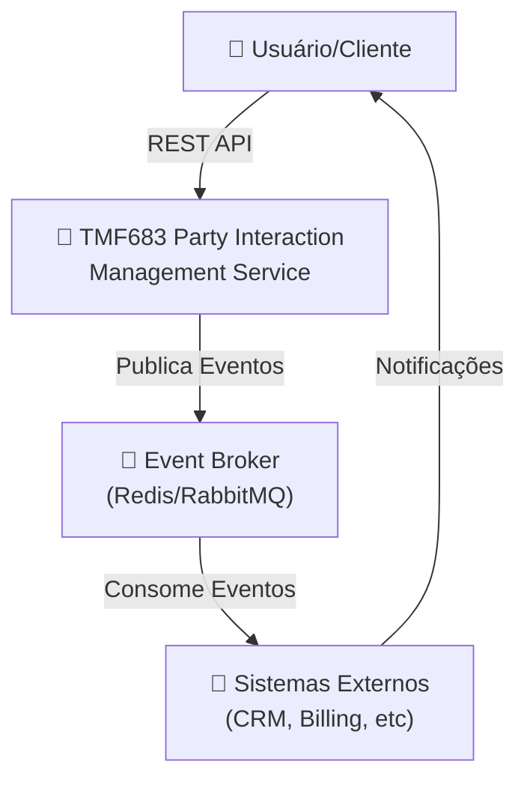
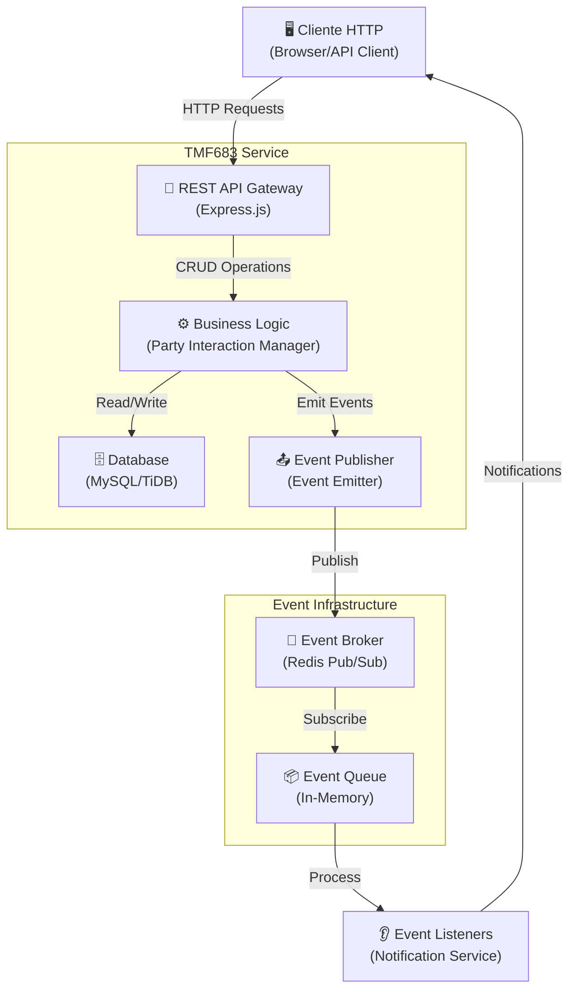
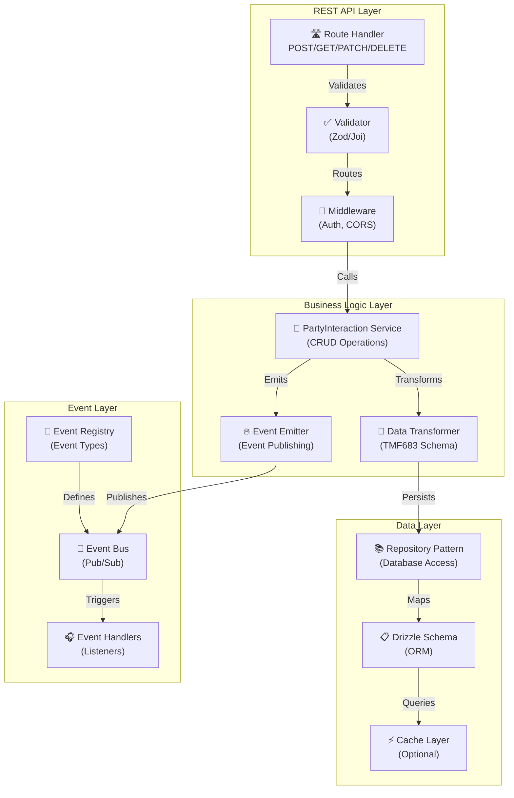

# Arquitetura C4 Model - TMF683 Party Interaction Management

## 1. Context Diagram (Nível 1)



## 2. Container Diagram (Nível 2)



## 3. Component Diagram (Nível 3)



## 4. Code Diagram (Nível 4)

### Estrutura de Dados PartyInteraction

```typescript
interface PartyInteraction {
  // Identificadores
  id: string;                    // UUID
  href: string;                  // URI da interação
  
  // Informações Básicas
  description: string;           // Descrição da interação
  type: string;                  // Tipo (inbound, outbound, etc)
  status: 'active' | 'inactive'; // Status
  
  // Datas
  creationDate: Date;            // Data de criação
  interactionDate: Date;         // Data da interação
  completionDate?: Date;         // Data de conclusão
  
  // Partes Envolvidas
  involvedParty: RelatedParty[]; // Partes na interação
  channel: ChannelRef;           // Canal de comunicação
  
  // Metadados
  characteristic?: Characteristic[]; // Atributos adicionais
  note?: Note[];                 // Anotações
  attachment?: Attachment[];     // Anexos
  
  // Timestamps
  createdAt: Date;
  updatedAt: Date;
}

interface RelatedParty {
  id: string;
  href: string;
  name: string;
  role: string;  // 'customer', 'agent', 'system'
}

interface ChannelRef {
  id: string;
  href: string;
  name: string;  // 'email', 'phone', 'chat', 'social'
}
```

### Fluxo de Eventos

```
1. PartyInteractionCreatedEvent
   - Emitido quando nova interação é criada
   - Contém dados completos da interação
   - Subscribers: Notification Service, Analytics Service

2. PartyInteractionUpdatedEvent
   - Emitido quando interação é modificada
   - Contém dados antigos e novos
   - Subscribers: Audit Service, Analytics Service

3. PartyInteractionDeletedEvent
   - Emitido quando interação é deletada
   - Contém ID e metadados
   - Subscribers: Audit Service, Cleanup Service
```

### Endpoints REST TMF683

```
POST   /partyInteraction
       Criar nova interação
       Request: PartyInteraction_Create
       Response: PartyInteraction (201)

GET    /partyInteraction
       Listar interações (com paginação)
       Query: fields, offset, limit
       Response: PartyInteraction[] (200)

GET    /partyInteraction/{id}
       Obter interação específica
       Response: PartyInteraction (200)

PATCH  /partyInteraction/{id}
       Atualizar interação
       Request: PartyInteraction_Update
       Response: PartyInteraction (200)

DELETE /partyInteraction/{id}
       Deletar interação
       Response: (204)
```

## Padrões de Arquitetura Implementados

### 1. Repository Pattern
- Abstração do acesso a dados
- Facilita testes unitários
- Permite trocar implementação de persistência

### 2. Event-Driven Pattern
- Desacoplamento entre componentes
- Comunicação assíncrona
- Escalabilidade horizontal

### 3. Pub/Sub Pattern
- Event Broker centralizado
- Múltiplos subscribers
- Processamento independente

### 4. API Gateway Pattern
- Ponto de entrada único
- Validação centralizada
- Autenticação e autorização

### 5. CQRS (Opcional)
- Separação de Commands (escrita) e Queries (leitura)
- Modelos otimizados para cada operação
- Escalabilidade independente

## Fluxo de Requisição Completo

```
1. Cliente HTTP
   ↓
2. Express Router
   ↓
3. Middleware (Auth, CORS)
   ↓
4. Validator (Zod)
   ↓
5. Business Logic Service
   ↓
6. Repository (Database Access)
   ↓
7. Drizzle ORM
   ↓
8. MySQL Database
   ↓
9. Response Builder
   ↓
10. Event Emitter
    ↓
11. Event Broker (Redis)
    ↓
12. Event Listeners (Async)
    ↓
13. Notification Service
    ↓
14. Response to Client
```

## Princípios ODA Implementados

### 1. Modularidade
- Cada componente tem responsabilidade única
- Interfaces bem definidas
- Baixo acoplamento

### 2. Escalabilidade
- Stateless services
- Horizontal scaling
- Caching estratégico

### 3. Resiliência
- Error handling robusto
- Retry policies
- Circuit breakers

### 4. Observabilidade
- Logging estruturado
- Tracing distribuído
- Métricas

### 5. Segurança
- Validação de entrada
- Autenticação JWT
- Autorização baseada em roles
